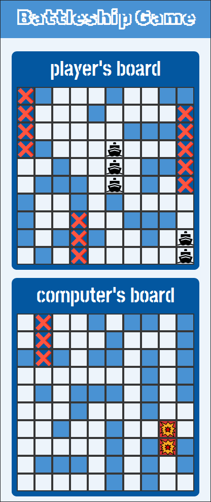

# Odin Project #17: Battleship

The goal of this Odin Project assignment was to create the Battleship game. In this project I practiced Test Driven Development and implemented unit tests for various class methods. Unlike the classic version of the game, ships can be placed next to each other. Additionally I implemented basic computer AI that hits player's board at random until it finds a ship and then tries adjacent spots until it sinks the found ships.

I started and finished this project in March 2023.

## Assignment

[The Odin Project - JavaScript - #17 Battleship](https://www.theodinproject.com/lessons/node-path-javascript-battleship)

## Technology

- Vanilla JavaScript
- Webpack
- Jest
- CSS

## Key Concepts

- Object Oriented Programming
- Test Driven Development
- Jest (unit tests)
- Classes

## Features

- Playing against an AI
- AI checks adjacent coordinates in later moves after finding a ship
- Player can place ships randomly or by drag and dropping them onto the board (only supported on desktop so far)

## Links

[Live Demo](https://brightneon7631.github.io/odin-battleship/)

[My Other Projects](https://brightneon7631.github.io/odin-scrimba-projects/)

## Screenshots

### Desktop


### Mobile



### Tests


## Sources

<a href="https://www.flaticon.com/free-icons/ship" title="ship icons">- Ship icons created by Freepik - Flaticon</a>
<a href="https://www.flaticon.com/free-icons/damage" title="damage icons">- Damage icons created by Febrian Hidayat - Flaticon</a>
<a href="https://www.flaticon.com/free-icons/cross" title="cross icons">- Cross icons created by Freepik - Flaticon</a>
- https://unsplash.com/photos/9oqEDetfT9M by Karl Groendal
- https://fonts.google.com/specimen/Rubik+Iso
- https://fonts.google.com/specimen/Stick+No+Bills

## Deployment

```bash
# clone repo
git clone

# install project dependencies
npm install

# run webpack dev server / live preview
npm start

# create a production build
npm run build
```